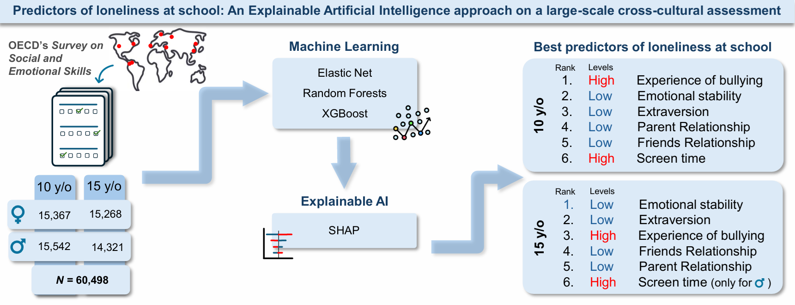

# Predictors of loneliness at school: An Explainable Artificial Intelligence approach on a large-scale cross-cultural assessment.


License: [](https://creativecommons.org/licenses/by-nc-sa/4.0/) [](https://creativecommons.org/licenses/by-nc-sa/4.0/)


------------------------------------------------------------------------

### Overview


This repository contains the code and models used to investigate school-based predictors of loneliness in adolescents, using data from 60,498 students
(ages 10 and 15) collected via the OECD’s SSES survey. We adopt a data-driven approach, applying three machine learning algorithms (Elastic Net,
Random Forest, and XGBoost)
alongside Explainable AI (XAI) techniques to assess the impact of a wide range of psychosocial variables.

### Citation

> Zasso, S., De Marco, L., Sette, S., Stella, M., & Perinelli, E. (2025). Predictors of loneliness at school: An Explainable Artificial Intelligence approach on a large-scale cross-cultural assessment. _Personality and Individual Differences, 246_, 113346. https://doi.org/10.1016/j.paid.2025.113346


### BibTex Citation

```bibtex
@article{ZASSO2025113346,
title = {Predictors of loneliness at school: An explainable artificial intelligence approach on a large-scale cross-cultural assessment},
journal = {Personality and Individual Differences},
volume = {246},
pages = {113346},
year = {2025},
issn = {0191-8869},
doi = {https://doi.org/10.1016/j.paid.2025.113346},
author = {Simone Zasso and Lavinia {De Marco} and Stefania Sette and Massimo Stella and Enrico Perinelli}
}
```

------------------------------------------------------------------------





------------------------------------------------------------------------

### File Description

- `functions.py`: Utility functions for descriptive statistics, correlations, and scale reliability.


- `ML_XAI_functions.py`: Functions to train and evaluate Elastic Net, Random Forest, and XGBoost models, including feature importance and XAI.

- `main_ML_XAI_2024.ipynb`: Code to run data preprocessing, model training (Elastic Net, Random Forest, XGBoost), evaluation, 
and application of Explainable AI techniques (SHAP, feature importance).

------------------------------------------------------------------------


**For any questions or inquiries, please contact simone.zasso@unitn.it**


